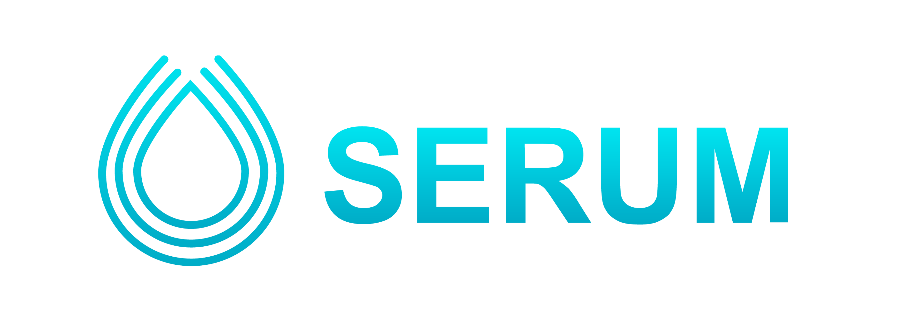

## Welcome to mmb
Mmb is an open-source trading engine implemented in Rust

## Connectors

 GREEN - Connector is working properly and safe to use

 YELLOW - Connector is either new or has one or more issues

 RED - Connector is broken and unusable


|                                            logo                                             |           id           |                                  name                                  | ver | doc |            status             |
|:-------------------------------------------------------------------------------------------:|:----------------------:|:----------------------------------------------------------------------:|:---:|:---:|:-----------------------------:|
|                               |        Binance         |               [Binance Spot](https://www.binance.com/)                |  3  | [API](https://binance-docs.github.io/apidocs/spot/en/#change-log) |    |
|                               |        Binance         |          [Binance USDⓈ-M Futures](https://www.binance.com/)           |  3  | [API](https://binance-docs.github.io/apidocs/futures/en/#general-info) |    |
|  |         Bitmex         |                   [Bitmex](https://www.bitmex.com/)                    |  1  | [API](https://www.bitmex.com/app/apiOverview) |  |
|                                 |         Serum          |                 [Serum](https://www.projectserum.com/)                 |  1  | [API](https://docs.projectserum.com/serum-ecosystem/build-on-serum/project-ideas-for-serum) |  |
|       |          IBKR          | [Interactive Brokers](https://www.interactivebrokers.com/ru/home.php/) |  1  | [API](https://www.interactivebrokers.com/api/doc.html) |  |


## Quick Start

1. Go to `example/src` directory
2. Configure your strategy in `config.toml`
3. Provide api keys and secrets in `credentials.toml`
```
[Binance_0]
api_key = "..."
secret_key = "..."
```
4. Execute `cargo build`
5. Execute `cargo run`

## Contributions

We welcome contributions from the community:
- **Code and documentation contributions** via [pull requests](https://github.com/purefinance/mmb/pulls)
- **Bug reports and feature requests** through [Github issues](https://github.com/purefinance/mmb/issues)
